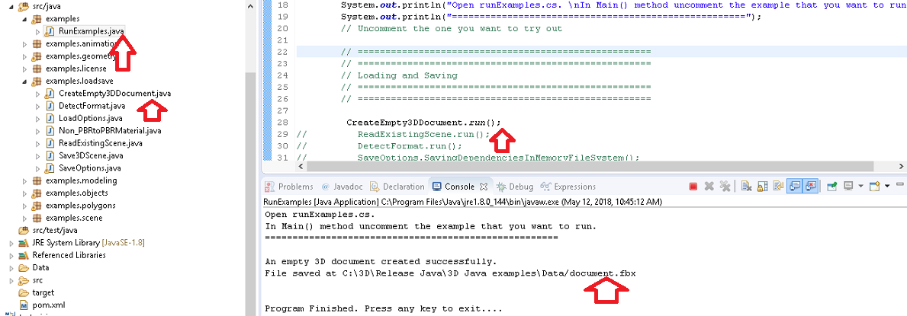

## **Download from GitHub**
All examples of Aspose.3D for Java are hosted on [GitHub](https://github.com/aspose-3d/Aspose.3D-for-java). You can either clone the repository using your favorite GitHub client or download the ZIP file from [here](https://github.com/aspose-3d/Aspose.3D-for-Java/archive/master.zip).

Extract the contents of ZIP file to any folder on your computer. All the examples are located in the `Examples` folder.

The `Data` folder contains input documents or files used in the examples.

{} 

Examples are in the form of **Eclipse Project**. Please open the Examples in Eclipse using the `File > Open Projects from File System...` menu command and follow the steps. Now, you should be able to run the examples fine.

{} 
## **Run the Example**
Once, you open the Examples in the Eclipse IDE, then select `RunExamples.java` file and uncomment any run method. For example, select this one `CreateEmpty3DDocument.run()` found inside the `src>java>examples>loadsave` directory or inside the package `examples.loadsave` and run it.

## **Screenshot**
Please see the following screenshot and its highlighted areas for more help.

