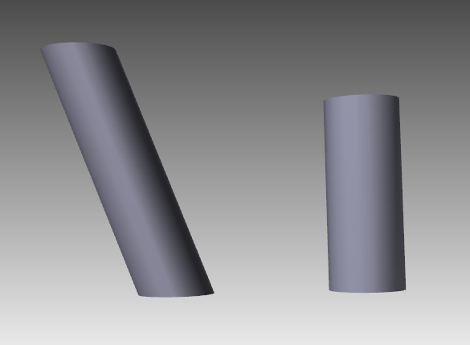

# **Customize Offset Top**
Aspose.3D for .NET allows customizing Offset Top of a cylinder. In order to use this functionality, you can use `Offset` property of `Cylinder` class. The following code snippet shows how to customize Offset Top:


// For complete examples and data files, please go to https://github.com/aspose-3d/Aspose.3D-for-.NET
// Create a scene
Scene scene = new Scene();
// Initialize cylinder
var cylinder1 = new Cylinder(2, 2, 10, 20, 1, false);
// Set OffsetTop
cylinder1.OffsetTop = new Vector3(5, 3, 0);
// Create ChildNode
scene.RootNode.CreateChildNode(cylinder1).Transform.Translation = new Vector3(10, 0, 0);
// Intialze second cylinder without customized OffsetTop
var cylinder2 = new Cylinder(2, 2, 10, 20, 1, false);
// Create ChildNode
scene.RootNode.CreateChildNode(cylinder2);
// Save
scene.Save("CustomizedOffsetTopCylinder.obj");



The left one has OffsetTop set to (5, 3, 0), it's easy to see the top cap has moved and the whole torso also gets affected.
# **Customize ShearBottom**
Aspose.3D for .NET allows customizing shear bottom of a cylinder. In order to use this functionality, you can use `ShearBottom` property of `Cylinder` class. The following code snippet shows how to customize Shear Bottom:


// For complete examples and data files, please go to https://github.com/aspose-3d/Aspose.3D-for-.NET
// Create a scene
Scene scene = new Scene();
// Create cylinder 1
var cylinder1 = new Cylinder(2, 2, 10, 20, 1, false);
// Customized shear bottom for cylinder 1
cylinder1.ShearBottom = new Vector2(0, 0.83);// shear 47.5deg in xy plane(z-axis)
// Add cylinder 1 to the scene
scene.RootNode.CreateChildNode(cylinder1).Transform.Translation = new Vector3(10, 0, 0);
// Create cylinder 2
var cylinder2 = new Cylinder(2, 2, 10, 20, 1, false);
// Add cylinder to without a ShearBottom to the scene
scene.RootNode.CreateChildNode(cylinder2);
// Save scene
scene.Save("CustomizedShearBottomCylinder.obj");



The left cylinder has `ShearBottom` to (0, 0.83) while the right one is an ordinal cylinder.
# **Create Fan-Cylinder**
Aspose.3D for .NET allows creating a fan cylinder. In order to use this functionality, you can set `GenerateFanCylinder` property of `Cylinder` class to `true`. The following code snippet shows how to use this functionality:


// For complete examples and data files, please go to https://github.com/aspose-3d/Aspose.3D-for-.NET
// Create a scene
Scene scene = new Scene();
// Create cylinder 1
var cylinder1 = new Cylinder(2, 2, 10, 20, 1, false);
// Customized shear bottom for cylinder 1
cylinder1.ShearBottom = new Vector2(0, 0.83);// shear 47.5deg in xy plane(z-axis)
// Add cylinder 1 to the scene
scene.RootNode.CreateChildNode(cylinder1).Transform.Translation = new Vector3(10, 0, 0);
// Create cylinder 2
var cylinder2 = new Cylinder(2, 2, 10, 20, 1, false);
// Add cylinder to without a ShearBottom to the scene
scene.RootNode.CreateChildNode(cylinder2);
// Save scene
scene.Save("CustomizedShearBottomCylinder.obj");



The left cylinder has `GenerateFanCylinder = false` and the right one has `GenerateFanCylinder = true`.
