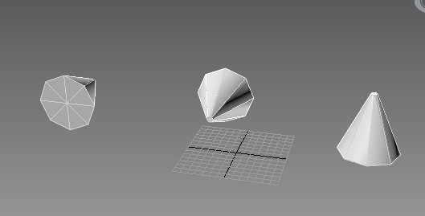

{} 

[Aspose.3D for .NET](https://www.aspose.com/products/3d) allows developers to combine two rotation transformation into one represented in a quaternion.

{} 
## **Concatenate Quaternions**
Quaternions are used to represent an orientation in 3D space. The `Concat` method exposed by the [`Quaternion`](https://reference.aspose.com/3d/net/aspose.threed.utilities/quaternion) class can be used to combine two quaternions. In this code example, we combine two quaternions and get a third resulting quaternion, and then apply these three quaternions to three cylinders.
### **Programming Sample**
This code example combine two quaternions and apply them to different cylinders.


// For complete examples and data files, please go to https://github.com/aspose-3d/Aspose.3D-for-.NET

            Scene scene = new Scene();

            Quaternion q1 = Quaternion.FromEulerAngle(Math.PI * 0.5, 0, 0);
            Quaternion q2 = Quaternion.FromAngleAxis(-Math.PI * 0.5, Vector3.XAxis);
            // Concatenate q1 and q2. q1 and q2 rotate alone x-axis with same angle but different direction,
            // So the concatenated result will be identity quaternion.
            Quaternion q3 = q1.Concat(q2);

            // Create 3 cylinders to represent each quaternion
            Node cylinder = scene.RootNode.CreateChildNode("cylinder-q1", new Cylinder(0.1, 1, 2));
            cylinder.Transform.Rotation = q1;
            cylinder.Transform.Translation = new Vector3(-5, 2, 0);

            cylinder = scene.RootNode.CreateChildNode("cylinder-q2", new Cylinder(0.1, 1, 2));
            cylinder.Transform.Rotation = q2;
            cylinder.Transform.Translation = new Vector3(0, 2, 0);

            cylinder = scene.RootNode.CreateChildNode("cylinder-q3", new Cylinder(0.1, 1, 2));
            cylinder.Transform.Rotation = q3;
            cylinder.Transform.Translation = new Vector3(5, 2, 0);
            // Save to file
            scene.Save("test_out.fbx");



**Result in 3ds MAX**

