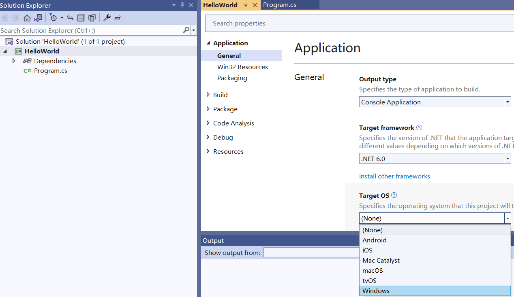

## Overview

For the .NET6 (or later) platforms, compare to previous platforms (.netcore31 or before), an important difference is about the graphics library. 
In this official [Microsoft Document](https://learn.microsoft.com/en-gb/dotnet/core/compatibility/core-libraries/6.0/system-drawing-common-windows-only), it explains for .NET6 or later releases the graphics library "System.Drawing.Common" will be only supported on Windows, and gives recommendations to replace the graphics library.

For Apose.3D product, we have conducted the evaluation and have completed the migration of the graphics library. We use SkiaSharp instead of System.Drawing.Common in non-Windows systems, as suggested in Microsoft's official documentation. Please note that this critical change will take effect in Aspose.3D 22.10.1 or later for .Net6.

For .netcore31 or before, for compatibility and stability, currently we still use the "System.Drawing.Common" graphics library. The dependencies for .netcore31 or before are as follows:
- System.Drawing.Common, 4.7.0.
- System.Security.Cryptography.Pkcs, 5.0.1.
- System.Text.Encoding.CodePages, 4.7.0.

## Run Aspose.3D for .Net6 on Windows

First you can create a .net6 application with VS2022, then you can choose the following installation options:

### Install through nuget

1. Search for Aspose.3D from NuGet: [Aspose.3D for .NET NuGet Package](https://www.nuget.org/packages/Aspose.3D/). 
You can also install Aspose.3D from the Nuget package manager in VS2022.

2. "SkiaSharp" or "System.Drawing.Common" will be installed automatically as a dependency of Aspose.3D 22.10.1 or later for .Net6 platforms, which depends on "Target OS" configuration in your project.
- Set the "Target OS" to "Windows" for your project, you will use "System.Drawing.Common" as a dependency on your windows system for .Net6 project. In this configuration, the result of the drawing is closer to .netcore31 or before.
****
- Set the "Target OS" to "None" or other options for your project, you will use "SkiaSharp" as a dependency on your windows system for .Net6 project. *Please note the version that uses "SkiaSharp" as a dependency doesn't support printing to printer feature.*

### Install through msi or DLL

1. [Download Aspose.3D.msi or DLL](https://releases.aspose.com/3d/net/)

2. Open the installation directory or the DLL directory, then select step 3 or 4 below:

3. locate the "net6.0-windows" subdirectory, add the Aspose.3D.dll in it to your .net6 application. Manually add the following nuget packages to your .net6 project:
- System.Drawing.Common, 4.7.0.
- System.Security.Cryptography.Pkcs, 6.0.3.
- System.Text.Encoding.CodePages, 4.7.0.

In this way, you will use "System.Drawing.Common" as a dependency on your windows system for .Net6 project. In this configuration, the result of the drawing is closer to .netcore31 or before.

4. locate the "net6.0" subdirectory, add the Aspose.3D.dll in it to your .net6 application. Manually add the following nuget packages to your .net6 project:
- SkiaSharp, 2.88.6.
- System.Security.Cryptography.Pkcs, 6.0.3.
- System.Text.Encoding.CodePages, 4.7.0.

In this way, you will use "SkiaSharp" as a dependency on your windows system for .Net6 project. *Please note the version that uses "SkiaSharp" as a dependency doesn't support printing to printer feature.*
## Run Aspose.3D for .Net6 on Linux

Refer to the installation method on Windows, you can only select SkiaSharp as a graphics library dependency on Linux system.

You need to do the following additional operations to ensure proper use of SkiaSharp under Linux:

1. Run the following command in your Linux System:
```
apt-get update && apt-get install -y libfontconfig1
```
OR
```
apk update && apk add fontconfig 
```

2. Add the nuget packages "SkiaSharp.NativeAssets.Linux 2.88.6" to your .net6 project.

3. Or you can choose to add nuget packages "SkiaSharp.NativeAssets.Linux.NoDependencies 2.88.6" to your .net6 project, instead of the two steps above.

### Example Dockerfile for Ubuntu

1. Add the nuget packages "SkiaSharp.NativeAssets.Linux 2.88.6" to your .net6 project.

2. Use the following Dockerfile:

# Ubuntu 20.04
FROM mcr.microsoft.com/dotnet/runtime:6.0-focal AS base
WORKDIR /app

# add "libfontconfig1" package if using "SkiaSharp.NativeAssets.Linux" in your project
# Or you need to use "SkiaSharp.NativeAssets.Linux.NoDependencies" in your project
RUN apt-get update && apt-get install -y libfontconfig1

# Copy fonts from local to docker
# For example, put a "fonts" folder in your project folder, and put the font files in it,
# then, use the following line:
COPY fonts/ /usr/share/fonts

FROM mcr.microsoft.com/dotnet/sdk:6.0-focal AS build
WORKDIR /src
COPY ["Ubuntu_Docker.csproj", "."]
RUN dotnet restore "./Ubuntu_Docker.csproj"
COPY . .
WORKDIR "/src/."
RUN dotnet build "Ubuntu_Docker.csproj" -c Release -o /app/build

FROM build AS publish
RUN dotnet publish "Ubuntu_Docker.csproj" -c Release -o /app/publish

FROM base AS final
WORKDIR /app
COPY --from=publish /app/publish .
ENTRYPOINT ["dotnet", "Ubuntu_Docker.dll"]


### Example Dockerfile for Alpine

1. Add the nuget packages "SkiaSharp.NativeAssets.Linux 2.88.6" to your .net6 project.

2. Use the following Dockerfile:

#Alpine 3.16
FROM mcr.microsoft.com/dotnet/runtime:6.0-alpine3.16 AS base
WORKDIR /app

# add "fontconfig" package if using "SkiaSharp.NativeAssets.Linux" in your project
# Or you need to use "SkiaSharp.NativeAssets.Linux.NoDependencies" in your project
RUN apk update && apk add fontconfig 

# Copy fonts from local to docker
# For example, put a "fonts" folder in your project folder, and put the font files in it,
# then, use the following line:
COPY fonts/ /usr/share/fonts

FROM mcr.microsoft.com/dotnet/sdk:6.0-alpine3.16 AS build
WORKDIR /src
COPY ["Alpine_Docker.csproj", "."]
RUN dotnet restore "./Alpine_Docker.csproj"
COPY . .
WORKDIR "/src/."
RUN dotnet build "Alpine_Docker.csproj" -c Release -o /app/build

FROM build AS publish
RUN dotnet publish "Alpine_Docker.csproj" -c Release -o /app/publish

FROM base AS final
WORKDIR /app
COPY --from=publish /app/publish .
ENTRYPOINT ["dotnet", "Alpine_Docker.dll"]

