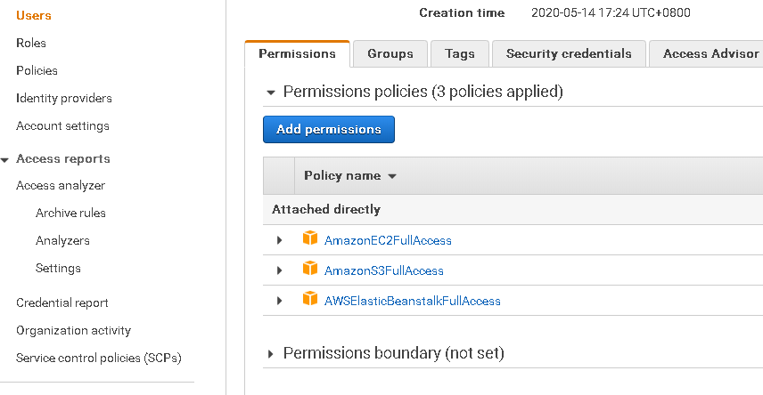

## Prepare AWS environment

1. Register an AWS account: 
[Register AWS account](https://aws.amazon.com/)
1. Login in your AWS account, add an IAM user under your account. You can refer to AWS official document:
[Add IAM user](https://docs.aws.amazon.com/IAM/latest/UserGuide/getting-started_create-admin-group.html)
1. Add permission “AmazonS3FullAccess”, please use the same way, add EC2 and Elastic Beanstalk, full access for each.
1. At the last step, make sure you get IAM user name, Key, Key ID, and “credentials.csv” file, you need to save them well.
   Now make sure your IAM user have S3, EC2, Elastic Beanstalk, full access. see:
   
****

## Install AWS Toolkit for Visual Studio

1. Install Visual Studio 2019 or above version.
1. Download and install AWS Toolkit for Visual Studio: 
[AWS Toolkit](https://aws.amazon.com/visualstudio/)

## Create a project running in AWS Lambda

1. Create an ASP.NET Core Web Application in Visual Studio, write test code, get Aspose.3D from nuget.

1. Make sure the test project runs well on your local machine, then deploy it to AWS Elastic Beanstalk:
   Right click the project name, choose "Publish to AWS Elastic Beanstalk". (This option will only exists after you install AWS Toolkit for Visual Studio). 
1. You will need to add a new user with your AWS account and IAM user, you can import "credentials.csv" file which you get in the previous step. 
1. Publish success, you will get a link address like: `http://testprojectaspose-test.us-west-2.elasticbeanstalk.com/`
   Wait 10 minutes for the link to take effect, then you can visit it!
