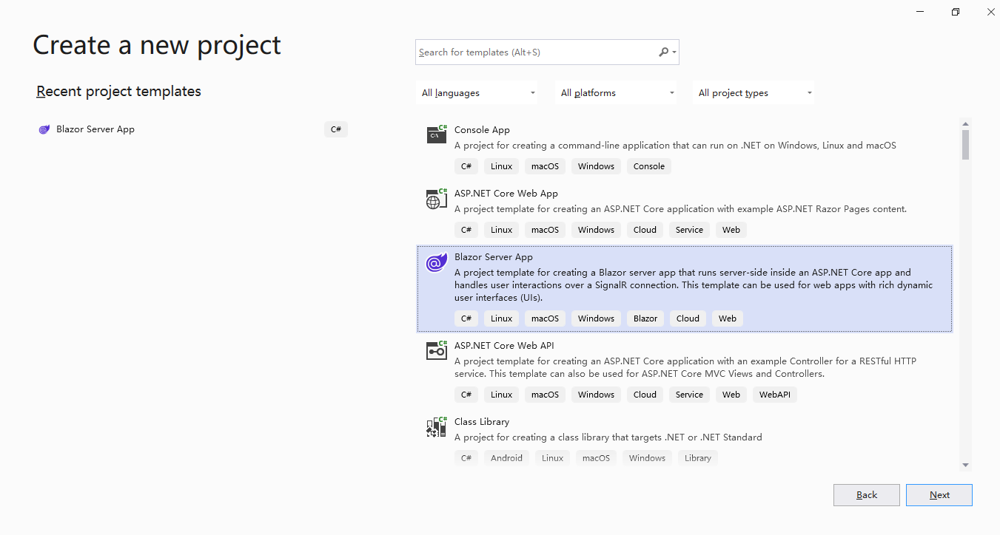
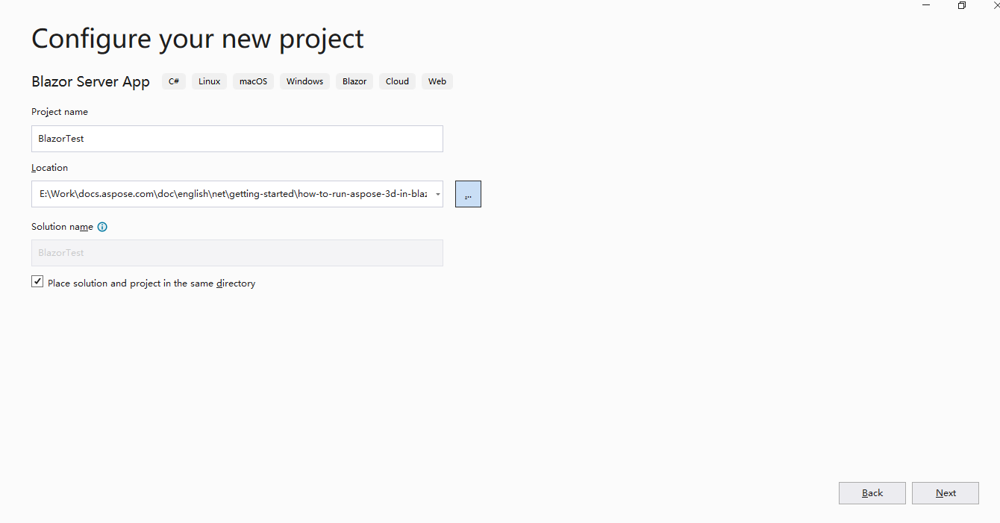
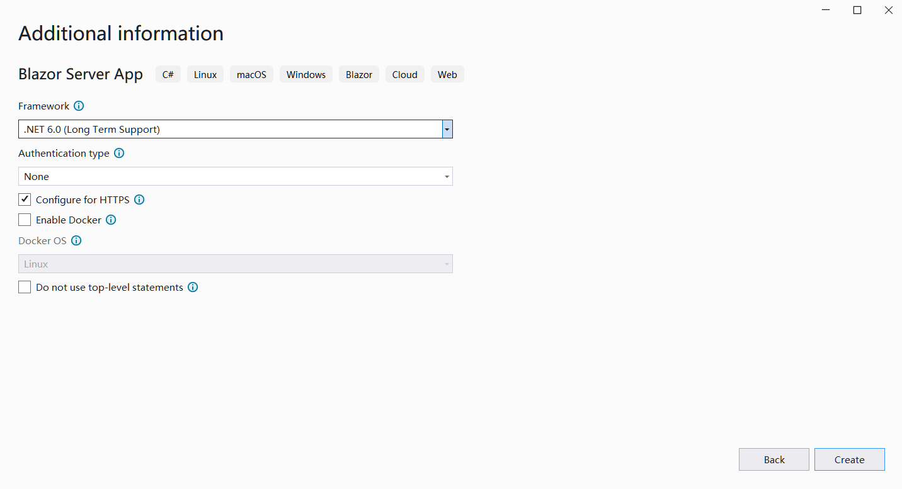
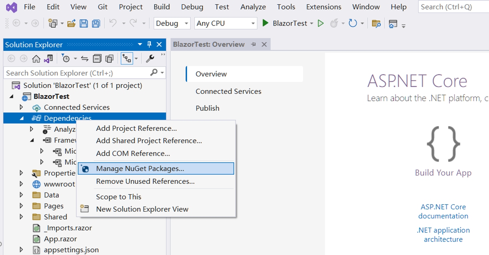
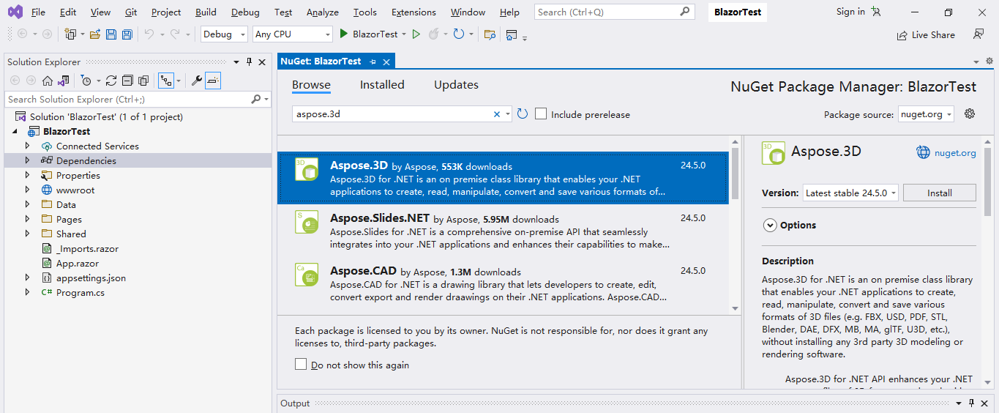
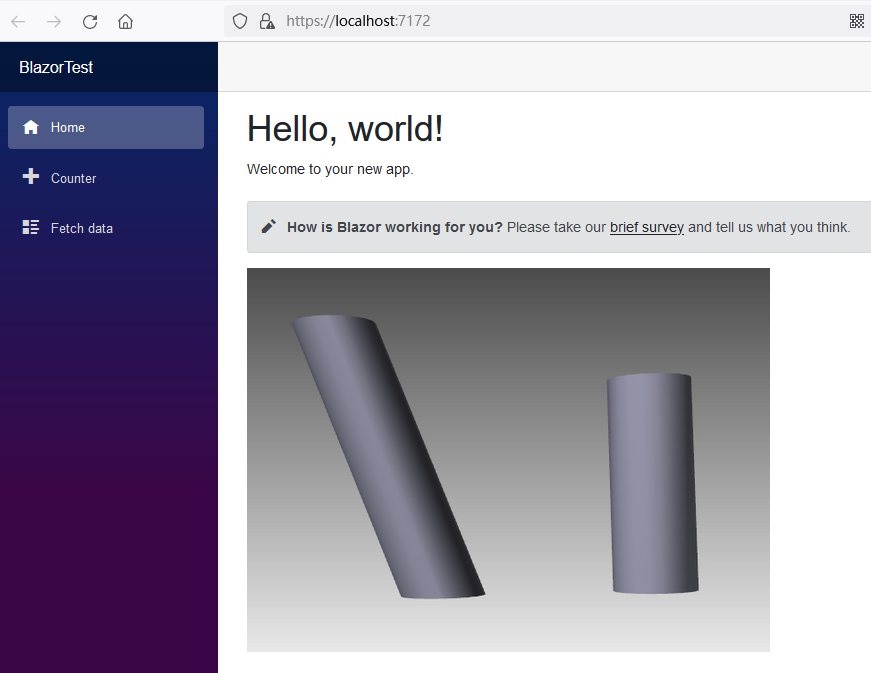

## Overview

Blazor is a web application framework developed by Microsoft that allows client-side web applications to be written using C# and .NET. Blazor is distinguished by its use of WebAssembly technology, which enables applications running in the browser to use high-performance native code. Blazor uses a componentized architecture, allowing developers to divide the UI into independent components, thereby achieving code reusability and maintainability. Blazor supports cross-platform development and can run on a variety of modern browsers and devices, including desktop, mobile, and embedded devices.

In general, Blazor provides a modern way to build web applications, enabling developers to build high-performance, interactive, and maintainable web applications using C# and .NET technologies in the browser.

## First Blazor Application with Aspose.3D

In this example, we created a simple Blazor server application, created a 3d file, and took a screenshot of the file content and displayed it on a web page. During the project creation process, we can configure it according to our needs, such as checking the "Enable Docker" option so that the Blazor application can be built and run in Docker.

### Create the First Blazor Application

Let's use the VS2022 tool as an example to create the first blazor application with Aspose.3D, follow the steps below:
1. Select File ->New ->Project and filter using the blazer keyword to select the corresponding project template.
<br>

1. Set the project name to "BlazorTest" and select the path.
<br>

1. Configure the libraries and other options used in the project. Finally, click the "Create" button to generate your first blazer project.
<br>

1. After entering the project, click the "Dependencies" under the project and select the "Manage NuGet Packages..." to add the Aspose.3D library.
<br>

1. Enter keywords for filtering and install the latest Aspose.3D library.
<br>

1. Double click on the "Index.razor" file to edit and import the required library. Add some data and pictures.
<br>

1. Compile and run the project, and you will get the following results.
<br>


### Sample Code in the First Blazor Application

The following sample code is included in the Index.razor file:
```
@page "/"
@using Aspose.ThreeD;
@using Aspose.ThreeD.Entities;
@using Aspose.ThreeD.Utilities;

<PageTitle>Index</PageTitle>

<h1>Hello, world!</h1>

Welcome to your new app.

<SurveyPrompt Title="How is Blazor working for you?" />


@code
{
    private string imageUrl="https://docs.aspose.com/3d/net/working-with-cylinder/working-with-cylinder_1.png";

    public Index()
    {
        CreateFile();
    }

    private void CreateFile()
    {
        // Create a scene
        Scene scene = new Scene();

        // Initialize cylinder
        var cylinder1 = new Cylinder(2, 2, 10, 20, 1, false);

        // Set OffsetTop
        cylinder1.OffsetTop = new Vector3(5, 3, 0);

        // Create ChildNode
        scene.RootNode.CreateChildNode(cylinder1).Transform.Translation = new Vector3(10, 0, 0);

        // Intialze second cylinder without customized OffsetTop
        var cylinder2 = new Cylinder(2, 2, 10, 20, 1, false);

        // Create ChildNode
        scene.RootNode.CreateChildNode(cylinder2);

        // Save
        scene.Save("CustomizedOffsetTopCylinder.obj");
    }
}

```