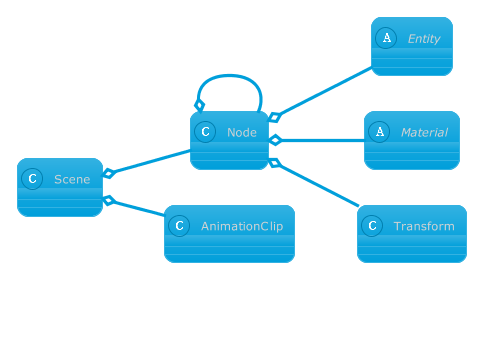
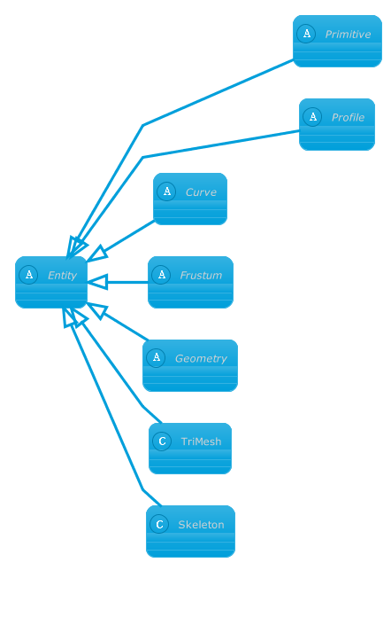
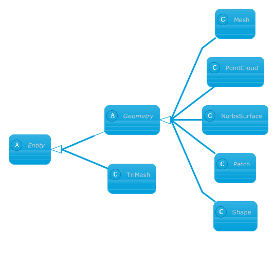
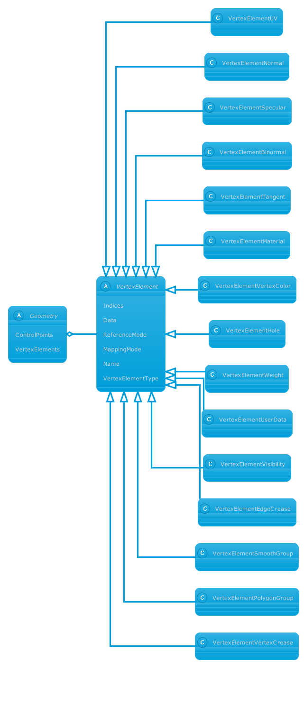
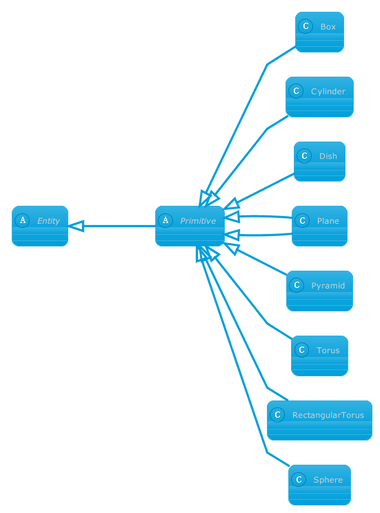
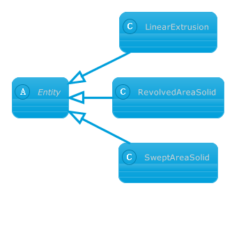
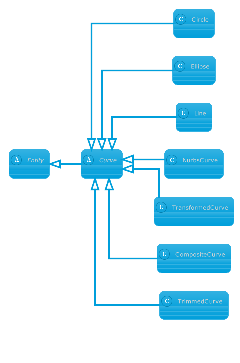
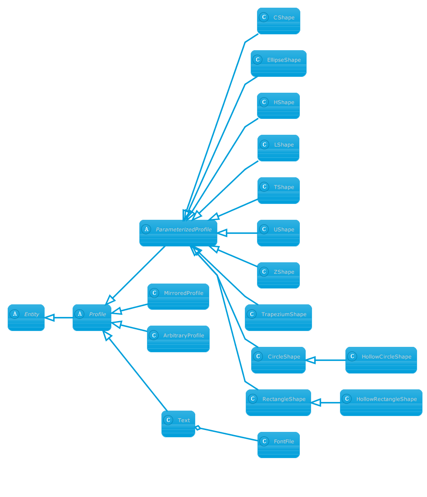
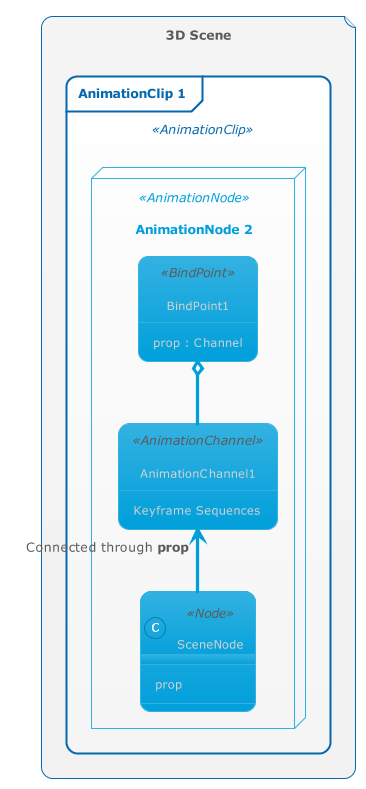

The Aspose.3D Document Object Model (DOM) is a powerful in-memory representation of a 3D scene. It provides developers with the ability to read, manipulate, and modify the content and formatting of a 3D scene programmatically.

In this section, we will explore the key classes of the Aspose.3D DOM and their relationships. By utilizing these classes, you can gain programmatic access to various elements within a 3D scene.

Let's delve into the main classes of the Aspose.3D DOM:

* **Scene**: The Scene class represents the root of the 3D scene hierarchy. It serves as the container for all other elements and provides methods to manipulate the overall scene.
* **Node**: Nodes are the building blocks of a 3D scene. They represent individual objects or entities within the scene, such as meshes, lights, cameras, or groups. Nodes can be transformed, animated, and textured.
* **Entities**: The Entities classes encompasses a broad range of objects and elements that make up a 3D scene. It includes entities such as meshes, lights, cameras, profiles, and more. These entities serve as building blocks, allowing you to create complex scenes by combining and manipulating them programmatically. The Entities category provides access and control over these fundamental elements of a 3D scene.
* **Materials**: The Materials classes revolves around defining the visual properties of objects within a 3D scene. It provides tools to programmatically create, modify, and control materials, which determine how light interacts with surfaces. By adjusting properties like color, texture, transparency, and reflection, you can achieve various visual effects and customize the appearance of your 3D models.
* **Animations**: The Animation classes focuses on creating and controlling movement and transformations within a 3D scene. It allows you to programmatically define and manipulate animations, enabling objects to move, rotate, scale, or change properties over time. With this category, you can bring dynamic and interactive elements to your 3D scenes.

By utilizing the Aspose.3D DOM classes mentioned above, you can programmatically interact with and manipulate the content and structure of a 3D scene. This provides flexibility and control when working with 3D models in your applications.

## Scene structure

When Aspose.3D reads a 3D file into memory, it generates objects of various types to represent the different elements within the 3D scene.

The scene structure in Aspose.3D follows the composite design pattern, which offers flexibility and organization:

 * Node serve as containers that can hold other nodes, allowing for grouping of different objects within the scene. 
 * Each node can have its own transformation, which also applies to its child nodes.
 * All spatial entity types in Aspose.3D must be placed under a Node instance. This ensures that objects such as meshes, lights, cameras, and other elements are organized within the scene hierarchy.
 * Nodes can contain multiple materials, and the relationship between polygons and materials attached to a node is addressed using the `VertexElementMaterial` concept within the Mesh object.

## Spatial Entities
All spatial entities within Aspose.3D inherit from the `Entity` class, serving as fundamental building blocks for constructing virtual environments. Aspose.3D categorizes these entities into several major categories, each with its own specific purpose and functionality.

* **Primitive** The `Primitive` class serves as the base class for all procedural 3D geometries within Aspose.3D, such as `Cylinder`, `Torus`, and `Sphere`. These geometries can be defined using a minimal set of parameters, making it convenient to create basic 3D shapes.
* **Geometry**: Geometries in Aspose.3D typically consist of vertices, edges, and polygons that define the shape and structure of a 3D object. This category encompasses a wide range of complex geometries used to represent various objects within a 3D scene.
* **Profile**: Profiles, similar to primitives, define 2D closed contours in the x-y plane. They provide a way to create 2D shapes that can be extruded to generate corresponding 3D geometries. Profiles are often used as a starting point for creating more intricate 3D objects.
* **Curve**: Unlike profiles, curves can be open or unconnected. They are utilized to define spatial paths in 3D. Curves provide a means to create flexible and customizable paths that objects can follow within a 3D environment.
* **Extrusion**: Extrusions are a procedural technique employed to construct 3D geometries using profiles and curves. By applying extrusion to a profile or a curve, a 3D shape can be generated by extending the profile or curve along a specified direction. This approach enables the creation of more complex and dynamic geometries.
* **Frustum**: The frustum category includes objects such as lights and cameras. Frustums define the viewing volume and perspective in a 3D scene. Cameras use frustums to determine the portion of the scene that will be visible, while lights utilize frustums to define the region within which they illuminate the scene.

These major entity categories in Aspose.3D encompass a variety of entities that play essential roles in constructing and representing virtual environments, providing a versatile toolkit for creating and manipulating 3D scenes.

### Geometry types

Aspose.3D contains many geometry types:

* `Mesh` Authoring tool friendly polygon mesh.
* `PointCloud` Point cloud.
* `NurbsSurface` Non-Uniform Rational B-Spline surfaces.
* `Patch` Surface defined by a set of control points and blending functions.
* `TriMesh` Render API-friendly triangle-based mesh.

The most important of them are `Mesh` and `TriMesh`, the differences are in the table:

| Feature | `Mesh` | `TriMesh` |
| ---     |---     |---        |
| Non-triangle Polygon | Yes | No | 
| Easy to modify | Yes | No |
| Data index reuse | Yes | No |
| CPU Cache friendly| No | Yes   |
| Rendering API friendly | No | Yes |
| Fixed memory layout | No | Yes | 

Classes derived from `Geometry` is designed for modify and content creation while the `TriMesh` is designed for rendering.

A `Geometry` consists of control points and `VertexElement` which defined extra data for control point/edge/polygon/polygon vertex, `Geometry` can contains zero or more `VertexElement`, concrete `Geometry` sub classes implemented different methods for modeling and representing 3D geometries.

### Primitive geometry types

Aspose.3D provides a set of predefined primitive geometry types that follow specific rules and algorithms to generate 3D models. These primitive types simplify the process of creating 3D geometries compared to using more complex Geometry types.

The available predefined primitive types in Aspose.3D include:

*  `Box`: The box primitive allows you to create rectangular cuboid shapes defined by their width, height, and depth.
*  Cylinder: With the cylinder primitive, you can generate cylindrical shapes by specifying the radius and height. This is useful for creating objects like tubes or columns.
*  `Dish`: The dish primitive enables the creation of dish-shaped geometries, commonly used to represent objects like bowls or satellite dishes.
*  `Plane`: The plane primitive generates flat surfaces defined by their width and length. It is frequently used as a foundation or ground plane in 3D scenes.
*  `Pyramid`: With the pyramid primitive, you can create pyramid-shaped geometries characterized by their base size and height. This is useful for constructing objects such as buildings or pyramids.
*  `Torus`: The torus primitive allows you to generate doughnut-shaped geometries with specified radii for the major and minor circles. It is suitable for creating objects resembling rings or tires.
*  `RectangularTorus`: The rectangular torus primitive produces torus-like geometries with rectangular cross-sections instead of circular ones. It provides additional flexibility for creating unique shapes.
*  `Sphere`: The sphere primitive generates perfectly round geometries based on the specified radius. This is useful for creating objects like planets or balls.

By utilizing these predefined primitive types in Aspose.3D, you can easily create a wide range of basic 3D geometries. This simplifies the modeling process and allows you to quickly shape and assemble objects within your 3D scenes.

### Extrusion Types

Extrusion can be used to create a variety of complex 3D objects, it is a fundamental method in 3D modeling that involves extending a 2D profile along a curve to create a 3D object.

In Aspose.3D we've provided 3 extrusion types:

* `LinearExtrusion` Linear extrusion takes a 2D profile as input and extends the shape in the 3rd dimension.
* `RevolvedAreaSolid` This class represents a solid model by revolving a cross section provided by a profile about an axis.
* `SweptAreaSolid` This class represents a solid model by a sweeping representation scheme allowing a 2D profile cross section to sweep through space.

### Curve Types

In Aspose.3D, a curve represents one or more spatial paths that can take various forms, such as lines, NURBS curves, or composite curves composed of multiple curve segments. Curves are commonly used in conjunction with extrusion types to create dynamic and intricate 3D shapes.

Curves can be employed to define complex paths that objects follow within a 3D environment, enabling smooth and precise movements. By utilizing different curve types and composing them together, you can achieve versatile and customizable spatial paths for your 3D models.

Moreover, certain file formats supported by Aspose.3D also provide the capability to import and export curve data. This allows you to seamlessly integrate curves created in external applications or share curves generated within Aspose.3D with other software.

## Profile types

Aspose.3D offers a range of 2D profiles that can be utilized to create closed shapes or contours within a 3D environment. These profiles enable the creation of intricate 2D structures that can be further extruded or manipulated into 3D geometries. Here are some notable profile implementations in Aspose.3D:

* `ParameterizedProfile`: Aspose.3D provides several implementations that offer profiles with standard shapes. These predefined profiles allow for the quick creation of commonly used shapes such as circles, rectangles, and polygons.

* `MirroredProfile`: This profile type allows you to mirror an existing profile along the Y-axis, creating a symmetrical shape. It provides a convenient way to generate balanced and visually appealing profiles.

* `ArbitraryProfile`: With the arbitrary profile implementation, you can map an arbitrary curve to create a closed profile. This offers flexibility in designing custom shapes by defining a curve and converting it into a closed profile for further manipulation.

* `Text`: Aspose.3D includes the ability to generate profiles from text using a specified font. This feature allows you to create profiles in the shape of letters, numbers, or any other textual content, adding an element of personalization or branding to your 3D models.

### Camera and light types

## Material types

Aspose.3D provides support for various types of materials, including Lambert material, Phong material, PBR material, PBR specular material, and shader material (only available in FBX files).

Each material in Aspose.3D can have different attributes and properties that define its appearance and behavior within a 3D scene. These materials can be connected to texture instances, enhancing their visual characteristics.

Textures in Aspose.3D are associated with a specific material attribute. The texture type combines the parameter definitions for the image source and the texture sampler. By utilizing textures, you can apply detailed patterns, colors, and other visual effects to the surfaces of your 3D models.

With the support for a range of material types and the ability to connect textures, Aspose.3D offers flexibility in creating visually appealing and realistic materials for your 3D scenes.

## Animation objects relationship
Aspose.3D provides data-level animation support, and calculation support is currently being developed.

In Aspose.3D, a scene can contain multiple AnimationClip objects. Each animation clip can consist of multiple animation nodes. The animation node follows the composite design pattern, allowing for the creation of hierarchical structures with sub animation nodes.

Animation nodes can be associated with bind points, which define the properties of the target object that will be animated. Vectors are commonly used data types in many entity properties. Therefore, bind points can have different animation channels to update specific channels of the vector independently. Each channel contains a keyframe sequence that defines how the value is animated over time.

This system provides a flexible framework for animating objects within a scene. By defining animation clips, nodes, bind points, and channels, you can create complex and dynamic animations that affect various properties of the entities in your 3D scene.

While Aspose.3D currently supports data-level animation, ongoing development is focused on expanding the calculation support, which will enhance the capabilities for creating and manipulating animations within the framework.

A scene with animations may have this kind of structure:

