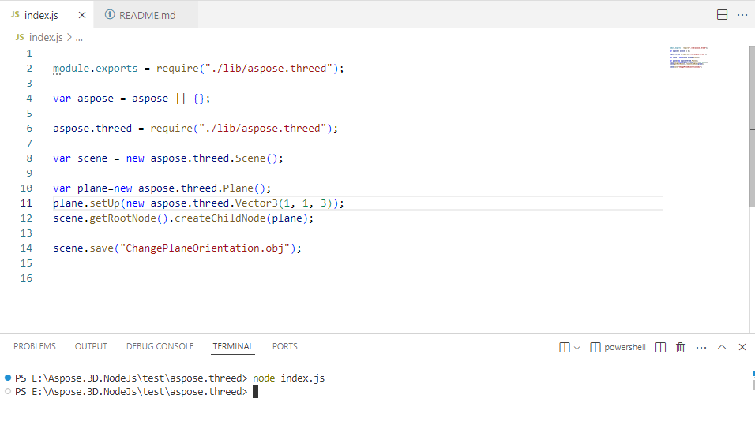

## **Download from NPM**
Aspose.3D for Node.js via Java examples and project packages are available on [NPM](https://www.npmjs.com/package/aspose.3d). You can use the npm i aspose.3d command to download it.You can also download the ZIP file from [here](https://releases.aspose.com/3d/nodejs-java/).

Extract the contents of the ZIP file to any folder on your computer. You can view the project package.

The `README` file contains some sample code.

{} 

Open the project with VSCode and follow the steps. You should now be able to run the examples normally.

{} 
## **Run the Example**
After opening the project in VSCode, find the README file, select an example from it and copy it to the index.js file. If the path of the aspose.threed file is incorrect, you need to modify it. Enter the command `node index.js` in the terminal. Then you will see the successfully generated 3D file in the folder.

## **Screenshot**
Please refer to the following screenshot for more assistance.

