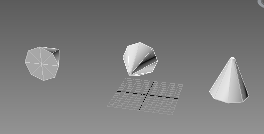

{} 

[Aspose.3D for Python via .NET](https://www.aspose.com/products/3d) allows developers to combine two rotation transformation into one represented in a quaternion.

{} 
## **Concatenate Quaternions**
Quaternions are used to represent an orientation in 3D space. The `concat` method exposed by the [`Quaternion`](https://reference.aspose.com/3d/net/aspose.threed.utilities/quaternion) class can be used to combine two quaternions. In this code example, we combine two quaternions and get a third resulting quaternion, and then apply these three quaternions to three cylinders.
### **Programming Sample**
This code example combine two quaternions and apply them to different cylinders.


from aspose.threed import FileFormat, Scene
from aspose.threed.entities import Cylinder
from aspose.threed.utilities import Quaternion, Vector3
import math

#  For complete examples and data files, please go to https:# github.com/aspose-3d/Aspose.3D-for-.NET
scene = Scene()
q1 = Quaternion.from_euler_angle(math.pi * 0.5, 0, 0)
q2 = Quaternion.from_angle_axis(-math.pi * 0.5, Vector3.X_AXIS)
#  Concatenate q1 and q2. q1 and q2 rotate alone x-axis with same angle but different direction,
#  So the concatenated result will be identity quaternion.
q3 = q1.concat(q2)
#  Create 3 cylinders to represent each quaternion
cylinder = scene.root_node.create_child_node("cylinder-q1", Cylinder(0.1, 1, 2))
cylinder.transform.rotation = q1
cylinder.transform.translation = Vector3(-5, 2, 0)
cylinder = scene.root_node.create_child_node("cylinder-q2", Cylinder(0.1, 1, 2))
cylinder.transform.rotation = q2
cylinder.transform.translation = Vector3(0, 2, 0)
cylinder = scene.root_node.create_child_node("cylinder-q3", Cylinder(0.1, 1, 2))
cylinder.transform.rotation = q3
cylinder.transform.translation = Vector3(5, 2, 0)
output = "out"  + "test_out.fbx"
#  Save to file
scene.save(output, FileFormat.FBX7400ASCII)


**Result in 3ds MAX**

