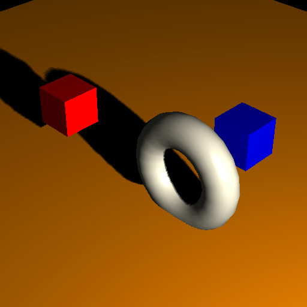

{}

Generally, some 3D file formats can store shadow related settings in geometry like FBX. Using [Aspose.3D for Python via .NET](https://products.aspose.com/3d/python-net/), developers can render an image by mapping shadows from the viewpoint of a light source. The image quality depends on the light source, elevation angle and distance between the camera and geometric objects.

{}
## **Cast and Receive Shadow**
By default, all objects in the scene cast shadows from a light source. Developers may also receive shadows on a per object basis in the object surface. This code example reveals how to set the position of light and camera objects. It also creates a plane and places three objects with different colors and shadow settings.

All geometries has `cast_shadows = True` and `receive_shadows = True`, the shadows of red box and torus casted to the plane, the red box won't receive shadows and blue box won't cast shadows.
### **Programming Sample**
This code example casts and Receives shadows on 3D geometries.



**Render Result**

