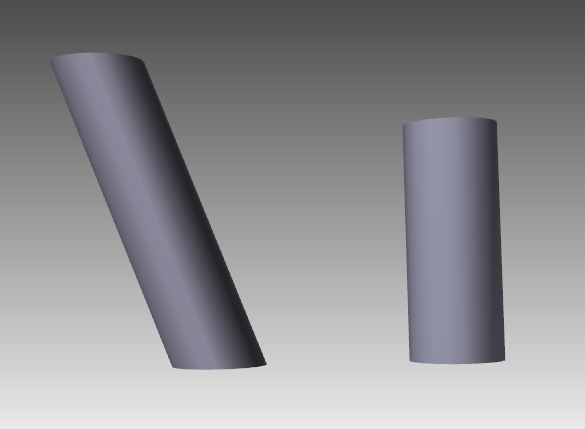
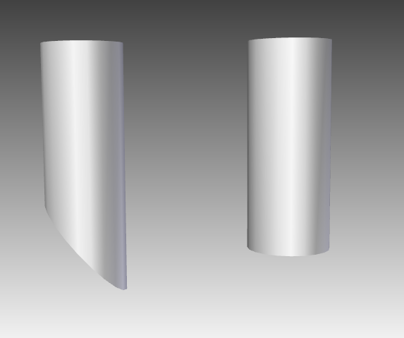

# **Customize Offset Top**
Aspose.3D for Python via .NET allows customizing Offset Top of a cylinder. In order to use this functionality, you can use `offset` property of `Cylinder` class. The following code snippet shows how to customize Offset Top:



The left one has `offset_top` set to (5, 3, 0), it's easy to see the top cap has moved and the whole torso also gets affected.
# **Customize ShearBottom**
Aspose.3D for Python via .NET allows customizing shear bottom of a cylinder. In order to use this functionality, you can use `shear_bottom` property of `Cylinder` class. The following code snippet shows how to customize Shear Bottom:



The left cylinder has `shear_bottom` to (0, 0.83) while the right one is an ordinal cylinder.
# **Create Fan-Cylinder**
Aspose.3D for Python via .NET allows creating a fan cylinder. In order to use this functionality, you can set `generate_fan_cylinder` property of `Cylinder` class to `True`. The following code snippet shows how to use this functionality:



The left cylinder has `generate_fan_cylinder = False` and the right one has `generate_fan_cylinder = True`.
