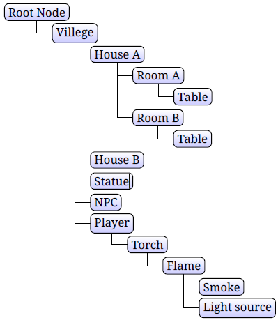

## **Add Node Hierarchy in 3D Scene Document**
Aspose.3D for Python via .NET offers to build a Node hierarchy. The Node is basic building block of a scene. A hierarchy of nodes defines the logical structure of a scene, and provide visible content by attaching geometries, lights, and cameras to nodes.
### **Scene Graph Example**
A sample scene hierarchy looks like:

In Aspose.3D, each Node instance can have multiple child nodes, in this example, we created a node with two cube nodes, if we rotate the root node, all child nodes are also get affected:


## **Share Mesh’s Geometry Data between Multiple Nodes**
To diminish memory necessities, a single instance of [Mesh](https://reference.aspose.com/3d/python-net/aspose.threed.entities/mesh) Class can be bound to various instances of [Node](https://reference.aspose.com/3d/net/aspose.threed/node) Class. Envision that you require a system where all 3D cubes seemed to be indistinguishable, however you required numerous a large number of them. You could spare memory by making one Mesh object when the system begins up. At that point, each time you required another shape, you make another Node object, then point that node to the one Mesh. This is called instancing. Aspose.3D for Python via .NET APIs allow to do instancing.
### **Instancing example**
In the RTS (Real-time strategy) games like, we can always see multiple NPCs (Non-Player Character) with same 3D model, maybe in different colors, rendering engine usually share same mesh geometry data across different NPCs, this technique is called Instancing.

{}

The Mesh class object is being used in the code. We can [create a Mesh class object as narrated there](/3d/python-net/create-3d-mesh-and-scene/).

{}

Demonstration of the example code:



In this example we created 3 cube nodes share the same mesh, each of them have different material with different colors.
